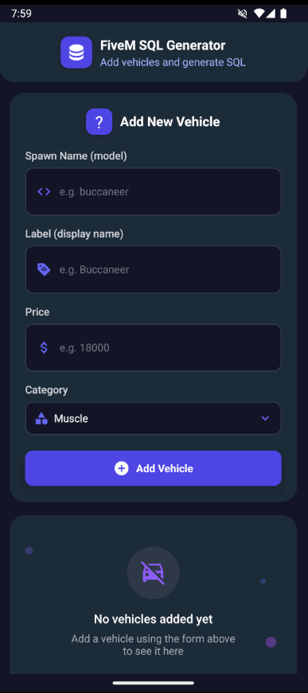
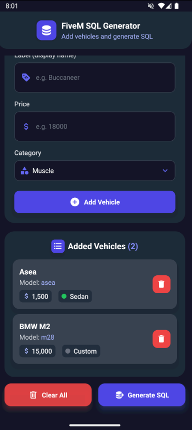
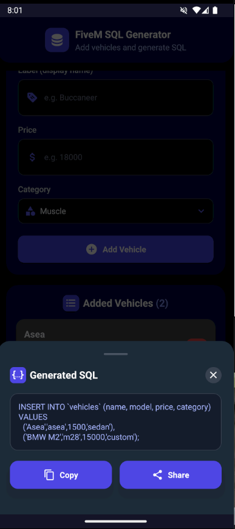
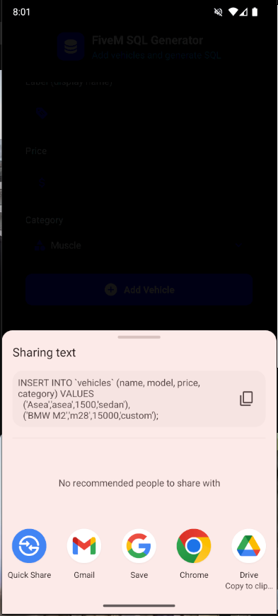

# FiveM SQL Generator


A React Native application designed to help FiveM server administrators generate SQL insert statements for vehicle databases quickly and efficiently.

## 📱 App Screenshots

<div style="display: flex; flex-wrap: wrap; gap: 10px; justify-content: center;">
  
  
  
  
  
  
  
  
</div>

## 🚀 Features

- **Vehicle Management**: Add, view, and delete vehicle entries with details including name, model, price, and category
- **SQL Generation**: Automatically generate properly formatted SQL insert statements for FiveM vehicle databases
- **Copy & Share**: Easily copy SQL statements to clipboard or share them with other applications
- **Intuitive UI**: Modern and responsive interface built with React Native and styled with NativeWind (TailwindCSS for React Native)
- **Dark Mode**: Sleek dark-themed interface for comfortable usage in low-light environments

## ⚙️ Tech Stack

- **React Native**: Cross-platform mobile application framework
- **TypeScript**: Type-safe JavaScript for robust code
- **NativeWind/TailwindCSS**: Utility-first CSS framework for styling
- **React Navigation**: Navigation library for React Native
- **React Native Vector Icons**: Icon library for UI elements
- **React Native Reanimated**: Animation library for smooth UI interactions

## 🏗️ Project Structure

```
/src
  /components        # Reusable UI components
  /images            # App images and assets
  /screens           # Main application screens
  /types             # TypeScript type definitions
  /utils             # Utility functions (SQL generation)
```

## 📋 Main Components

- **VehicleForm**: Component to add new vehicles with validation
- **VehicleList**: Component to display and manage the list of added vehicles
- **CategorySelection**: Custom dropdown for vehicle category selection
- **SQL Generator**: Utility to generate properly formatted SQL statements

## 💻 Installation & Setup

1. **Clone the repository**:
```bash
git clone https://github.com/yourusername/fivem-sql-generator.git
cd fivem-sql-generator
```

2. **Install dependencies**:
```bash
npm install
```

3. **Start Metro**:
```bash
npm start
```

4. **Run on Android**:
```bash
npm run android
```

5. **Run on iOS**:
```bash
npm run ios
```

## 🛠️ Usage

1. Add vehicles using the form at the top of the home screen
2. View and manage your vehicle list
3. Click "Generate SQL" to create the SQL insert statement
4. Copy the SQL to your clipboard or share it directly

## 📱 Device Compatibility

- iOS 12.0 and above
- Android 5.0 (API 21) and above

## 📄 License

This project is licensed under the MIT License - see the LICENSE file for details.

## 👥 Contributing

Contributions are welcome! Please feel free to submit a Pull Request.
